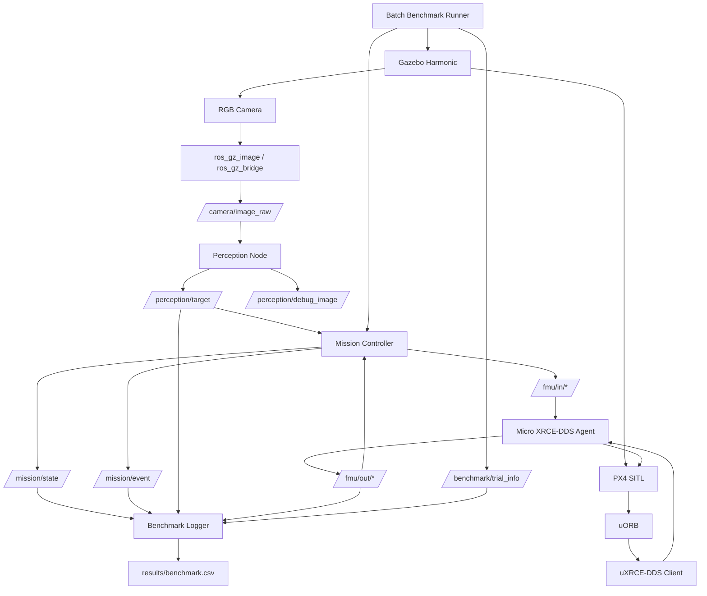

# 基于 ROS2 / PX4 / Gazebo 的无人机自主感知与任务仿真平台

本项目面向无人机自主感知、任务决策与闭环控制算法验证，基于 **ROS 2 Jazzy + PX4 SITL + Gazebo Harmonic + uXRCE-DDS**，搭建从虚拟传感器、视觉感知、任务状态机、PX4 Offboard 控制到自动化 Batch Benchmark 的完整闭环。

当前已实现：

> **起飞 → 搜索 → 检测 → 视觉引导接近 → 悬停 → 返航 → 降落**

并在随机目标位置下完成 **30 轮自动化 Benchmark，任务成功率 100%**。

---

## 1. 项目简介

本项目不是简单运行 PX4 / Gazebo 官方 Demo，而是搭建一个可持续扩展的无人机自主任务验证平台，用于验证：

- 无人机自主搜索
- 视觉目标检测
- 视觉伺服控制
- 任务状态机
- PX4 Offboard 控制
- 目标丢失后的重搜索
- 自动返航与降落
- 批量随机实验
- 自动化 Benchmark
- Failure Analysis

整体闭环如下：

```text
Gazebo 物理仿真 + RGB Camera
            │
            ├──────────────→ ROS2 Camera Bridge
            │                       │
            │                /camera/image_raw
            │                       │
            │                Perception Node
            │                       │
            │              /perception/target
            │                       │
            │                       ▼
PX4 SITL ← uXRCE-DDS ← ROS2 Mission Controller
   │                           │
   │                    Mission State Machine
   │                           │
   └──── Offboard Control ─────┘
            │
            ▼
        UAV Motion
            │
            └──────────────→ 新一帧相机观测
```

最终形成：

```text
物理仿真
   ↓
视觉感知
   ↓
任务决策
   ↓
飞行控制
   ↓
自动评测
```

的完整闭环。

---

## 2. 当前已实现功能

### 2.1 PX4 / Gazebo 仿真

- PX4 SITL 飞控仿真
- Gazebo Harmonic 物理环境
- 自定义 `x500_perception` 无人机模型
- RGB Camera
- PX4 NED 坐标系状态获取
- 自动起飞
- 位置控制
- 航向控制
- Return-to-Home
- AUTO LAND
- 自动 Disarm

### 2.2 ROS2 通信

- ROS 2 Jazzy
- `px4_msgs` 对接 PX4 v1.17
- Micro XRCE-DDS Agent
- PX4 uORB ↔ DDS ↔ ROS2
- Gazebo Camera ↔ ROS2 Bridge
- ROS2 Topic 驱动感知、任务和评测模块

### 2.3 视觉感知

当前版本使用红色目标板验证完整视觉闭环，感知流程为：

```text
RGB Image
   ↓
HSV 双红色区间分割
   ↓
Morphology Open / Close
   ↓
最大轮廓筛选
   ↓
Bounding Box
   ↓
Target Center
   ↓
Normalized Pixel Error
   ↓
Area Ratio
```

感知节点输出：

```text
detected
confidence

center_u
center_v

center_u_norm
center_v_norm

bbox_x
bbox_y
bbox_width
bbox_height

area_ratio
```

当前 HSV 检测器主要用于验证系统架构与控制闭环，后续可以直接替换为：

- YOLO
- RT-DETR
- Transformer-based Detector
- 目标跟踪器

而不需要改变 PX4、Mission Controller 与 Benchmark 框架。

---

## 3. 自主任务状态机

当前任务状态机：

```text
WAIT_FOR_PX4
      ↓
PRESTREAM
      ↓
REQUEST_OFFBOARD
      ↓
ARMING
      ↓
TAKEOFF
      ↓
HOVER
      ↓
SEARCH
      ↓
DETECT
      ↓
APPROACH
      ↓
HOLD
      ↓
RETURN
      ↓
LAND
      ↓
DONE
```

各阶段功能如下：

### WAIT_FOR_PX4

等待 PX4 状态与本地位置数据有效。

### PRESTREAM

提前持续发送 Offboard Control Mode 和 Position Setpoint，满足 PX4 Offboard 切换要求。

### REQUEST_OFFBOARD

请求 PX4 切换到 OFFBOARD 模式。

### ARMING

发送 Arm 指令。

### TAKEOFF

使用位置 Setpoint 起飞至设定高度。

### HOVER

到达目标高度后短暂稳定悬停。

### SEARCH

无人机保持当前位置并持续改变 yaw：

```text
yaw_target += search_yaw_rate × dt
```

实现原地旋转搜索。

### DETECT

通过多帧检测门控确认目标，降低瞬时误检引起的错误状态切换。

当前采用：

```text
Detection Gate = 6 / 10 frames
```

### APPROACH

根据目标横向图像偏差进行航向视觉伺服。

目标居中后逐步向前推进。

### HOLD

目标接近完成后保持当前位置。

### RETURN

飞回 Home 上方。

### LAND

切换 AUTO LAND，等待 PX4 Landing Detector 报告落地。

### DONE

确认落地并 Disarm，Mission Controller 自动退出。

---

## 4. 视觉伺服接近控制

### 4.1 横向视觉误差

定义归一化横向误差：

```text
ex = (u_target - image_width / 2)
     / (image_width / 2)
```

当前相机与 PX4 配置下：

```text
ex < 0
→ 目标位于图像左侧
→ yaw 减小

ex > 0
→ 目标位于图像右侧
→ yaw 增大
```

控制律：

```text
yaw_target = yaw_target + K_yaw × ex
```

当：

```text
|ex| > deadband
```

无人机只调整 yaw，不向前推进。

只有当：

```text
|ex| <= deadband
```

目标基本居中后，才逐步向当前机头方向更新位置 Setpoint。

因此闭环为：

```text
Camera
   ↓
Target Detection
   ↓
Pixel Error
   ↓
Yaw Control
   ↓
PX4
   ↓
UAV Motion
   ↓
New Camera Observation
```

---

## 5. 接近距离代理与分段减速

当前版本不直接估计目标三维距离，而使用：

```text
area_ratio
```

作为视觉接近程度代理。

定义为目标区域占整幅图像的比例。

控制策略：

```text
area_ratio < 0.012
→ Approach Speed = 0.30 m/s

0.012 <= area_ratio < 0.020
→ Approach Speed = 0.12 m/s

area_ratio >= 0.020
→ APPROACH SUCCESS
```

引入近距离减速后，可以减小达到停止阈值后的动态超调。

---

## 6. 目标丢失与重搜索

APPROACH 中允许短时间视觉掉帧。

若目标持续丢失超过：

```text
approach_target_lost_timeout
```

则：

```text
APPROACH
   ↓
停止向前运动
   ↓
保持当前空间位置
   ↓
SEARCH
   ↓
重新旋转搜索
   ↓
DETECT
   ↓
APPROACH
```

因此无人机无需返回 Home 后重新开始，而是在目标丢失位置继续恢复任务。

---

## 7. 系统架构



---

## 8. 主要 ROS2 Topic

| Topic | 方向 | 功能 |
|---|---|---|
| `/camera/image_raw` | Gazebo → ROS2 | RGB 图像 |
| `/camera/camera_info` | Gazebo → ROS2 | 相机参数 |
| `/perception/target` | Perception → Mission | 目标检测结果 |
| `/perception/debug_image` | Perception → Debug | 感知可视化 |
| `/fmu/out/vehicle_local_position_v1` | PX4 → ROS2 | 本地位置与速度 |
| `/fmu/out/vehicle_status_v1` | PX4 → ROS2 | 飞行器状态 |
| `/fmu/in/offboard_control_mode` | ROS2 → PX4 | Offboard 控制模式 |
| `/fmu/in/trajectory_setpoint` | ROS2 → PX4 | 位置与 yaw Setpoint |
| `/fmu/in/vehicle_command` | ROS2 → PX4 | 模式切换、Arm、Land 等 |
| `/mission/state` | Mission → Benchmark | 当前任务状态 |
| `/mission/event` | Mission → Benchmark | 任务事件 |
| `/benchmark/trial_info` | Batch Runner → Benchmark | Trial 编号、目标位置、Seed |

---

## 9. 项目目录

推荐目录结构：

```text
~/ROS2_manmade/
├── PX4-Autopilot/
│
├── ros2_ws/
│   └── src/
│       ├── uav_learning/
│       │   ├── launch/
│       │   │   └── camera_bridge.launch.py
│       │   │
│       │   └── uav_learning/
│       │       ├── perception_node.py
│       │       ├── px4_offboard_controller.py
│       │       ├── benchmark_logger.py
│       │       └── batch_benchmark.py
│       │
│       ├── uav_interfaces/
│       │   ├── msg/
│       │   │   └── TargetDetection.msg
│       │   ├── srv/
│       │   │   └── SetMode.srv
│       │   └── action/
│       │       └── FlyToAltitude.action
│       │
│       ├── px4_msgs/
│       └── Micro-XRCE-DDS-Agent/
│
├── config/
│   ├── red_target_board.sdf
│   └── perception_test_targets.sdf
│
├── results/
│   └── benchmark.csv
│
├── scripts/
│   ├── px4_env.sh
│   └── wsl_proxy.sh
│
└── docs/
```

自定义 Gazebo 模型：

```text
PX4-Autopilot/Tools/simulation/gz/models/
├── uav_rgb_camera/
└── x500_perception/
```

---

## 10. 开发环境

当前验证环境：

```text
宿主系统    : Windows 11
Linux       : WSL2 Ubuntu 24.04
ROS2        : Jazzy
PX4         : v1.17.0
Gazebo      : Harmonic / gz-sim 8
px4_msgs    : release/1.17
XRCE Agent  : Micro-XRCE-DDS-Agent
Python      : Python 3
OpenCV      : cv_bridge + python3-opencv
```

---

## 11. ROS2 Workspace 编译

完整编译：

```bash
cd ~/ROS2_manmade/ros2_ws

source /opt/ros/jazzy/setup.bash

colcon build --symlink-install

source install/setup.bash
```

只编译主要项目包：

```bash
colcon build \
  --symlink-install \
  --packages-select \
  uav_interfaces \
  uav_learning
```

---

## 12. 系统启动

为了便于排查问题，各模块采用独立终端运行。

### Terminal 1：PX4 + Gazebo

作用：

```text
Gazebo
→ 物理世界
→ 无人机
→ RGB Camera

PX4
→ 飞控
→ 状态估计
→ Offboard 控制
```

运行：

```bash
source ~/ROS2_manmade/scripts/px4_env.sh

cd ~/ROS2_manmade/PX4-Autopilot

PX4_SYS_AUTOSTART=4001 \
PX4_SIM_MODEL=gz_x500_perception \
./build/px4_sitl_default/bin/px4
```

注意：

> 该终端不要加载 ROS2 环境。

---

### Terminal 2：Micro XRCE-DDS Agent

作用：

```text
PX4 uORB
   ↓
uXRCE-DDS
   ↓
ROS2 /fmu/*
```

运行：

```bash
source /opt/ros/jazzy/setup.bash
source ~/ROS2_manmade/ros2_ws/install/setup.bash

MicroXRCEAgent udp4 -p 8888
```

---

### Terminal 3：Camera Bridge

作用：

```text
Gazebo Camera
     ↓
ROS2
     ↓
/camera/image_raw
```

运行：

```bash
source /opt/ros/jazzy/setup.bash
source ~/ROS2_manmade/ros2_ws/install/setup.bash

ros2 launch uav_learning camera_bridge.launch.py
```

检查：

```bash
ros2 topic hz /camera/image_raw
```

---

### Terminal 4：Perception Node

运行：

```bash
source /opt/ros/jazzy/setup.bash
source ~/ROS2_manmade/ros2_ws/install/setup.bash

ros2 run uav_learning perception_node
```

可视化：

```bash
ros2 run rqt_image_view rqt_image_view
```

选择：

```text
/perception/debug_image
```

---

### Terminal 5：Benchmark Logger

运行：

```bash
source /opt/ros/jazzy/setup.bash
source ~/ROS2_manmade/ros2_ws/install/setup.bash

ros2 run uav_learning benchmark_logger
```

注意：

> `benchmark_logger` 只能运行一个实例，否则多个 Logger 会同时向同一个 CSV 写入数据，产生重复记录。

检查：

```bash
pgrep -af benchmark_logger
```

---

### Terminal 6：单次 Mission

单次验证：

```bash
source /opt/ros/jazzy/setup.bash
source ~/ROS2_manmade/ros2_ws/install/setup.bash

ros2 run uav_learning px4_offboard_controller \
  --ros-args \
  -p approach_timeout:=130.0 \
  -p approach_target_lost_timeout:=1.2
```

任务完成后：

```text
LAND -> DONE
```

Mission Controller 会自动退出。

---

### Terminal 6：Batch Benchmark

进行 Batch Benchmark 时：

> 不需要手动启动 `px4_offboard_controller`。

Batch Runner 会自动创建和关闭每轮 Mission Controller。

运行：

```bash
source /opt/ros/jazzy/setup.bash
source ~/ROS2_manmade/ros2_ws/install/setup.bash

ros2 run uav_learning batch_benchmark_runner \
  --ros-args \
  -p num_trials:=30 \
  -p seed:=20260920
```

自动执行：

```text
随机生成目标位置
       ↓
移动 Gazebo 红色目标板
       ↓
发布 Trial Metadata
       ↓
启动 Mission Controller
       ↓
执行自主任务
       ↓
MISSION_DONE
       ↓
关闭本轮 Controller
       ↓
进入下一轮
```

---

## 13. 自动化 Benchmark

### 13.1 测试设置

当前 Baseline：

```text
Trials              : 30
Seed                : 20260920

Target X            : 约 14–18 m
Target Y            : 约 14–19 m
Target Model Z      : 2.5 m

目标相对起点水平距离:
                     约 20.8–24.6 m

Takeoff Height      : 5 m

Search Yaw Rate     : 10 deg/s

Detection Gate      : 6 / 10 frames

Approach Speed      : 0.30 m/s

Slow Speed          : 0.12 m/s

Slow Threshold      : area_ratio >= 0.012

Success Threshold   : area_ratio >= 0.020
```

### 13.2 30 轮 Baseline 结果

对 `trial_id=1~30` 的独立实验进行统计：

| 指标 | 结果 |
|---|---:|
| 任务成功率 | **100%（30 / 30）** |
| 平均任务时间 | **167.44 s** |
| 中位任务时间 | **164.75 s** |
| 平均搜索时间 | **34.24 s** |
| 平均 APPROACH 时间 | **98.62 s** |
| 平均横向视觉误差 | **19.11 px** |
| 横向误差中位数 | **18.84 px** |
| 平均单轮 P95 横向误差 | **50.25 px** |
| 平均目标丢失次数 | **2.83 次 / mission** |
| 平均重新捕获次数 | **2.83 次 / mission** |
| 平均轨迹长度 | **55.37 m** |
| 平均返航水平误差 | **0.108 m** |
| P95 返航水平误差 | **0.166 m** |
| 最大返航水平误差 | **0.198 m** |

当前 RGB 图像宽度为 960 px，因此：

```text
平均横向误差
= 19.11 / 960
≈ 1.99% 图像宽度
```

结果表明，在当前随机目标区域和仿真配置下，系统已经能够稳定完成：

```text
起飞
→ 主动搜索
→ 目标检测
→ 视觉伺服接近
→ 丢失后重新捕获
→ 返航
→ 自动降落
```

完整任务。

> 早期调试过程中曾因同时运行多个 Benchmark Logger，导致 CSV 中出现重复记录。当前 30 轮统计按 `trial_id` 去重后计算。

---

## 14. Benchmark CSV

结果默认保存：

```text
~/ROS2_manmade/results/benchmark.csv
```

字段：

```text
trial_id
seed

target_x
target_y
target_z

timestamp_s

mission_success
failure_reason

mission_time_s
search_time_s
target_acquisition_time_s
detect_time_s
approach_time_s

mean_abs_pixel_error_px
p95_abs_pixel_error_px

target_lost_count
approach_reacquire_count

approach_start_area_ratio
approach_final_area_ratio

trajectory_length_3d_m
final_home_error_m
```

示例：

```csv
trial_id,seed,target_x,target_y,target_z,mission_success,...
1,20260920,16.35,17.55,2.5,1,...
```

---

## 15. 常见问题排查

### 15.1 PX4 Telemetry 不可用

检查 Agent：

```bash
MicroXRCEAgent udp4 -p 8888
```

PX4 Shell：

```text
pxh> uxrce_dds_client status
```

ROS2：

```bash
ros2 topic echo \
/fmu/out/vehicle_local_position_v1 \
--once
```

---

### 15.2 Camera Topic 存在但没有 Publisher

```bash
ros2 topic info /camera/image_raw -v
```

正常：

```text
Publisher count: 1
```

重新启动：

```bash
ros2 launch uav_learning camera_bridge.launch.py
```

---

### 15.3 PX4 Preflight Check 不通过

PX4 Shell：

```text
pxh> commander check
```

如果本地 SITL 无 GCS，并确认唯一相关问题为 GCS 数据链要求，可设置：

```text
pxh> param set NAV_DLL_ACT 0
```

不要绕过真正的传感器、Estimator 或系统健康问题。

---

### 15.4 检查残留 Mission Controller

新一轮 Batch 前：

```bash
pgrep -af px4_offboard_controller
```

正常情况下不应存在上一轮残留 Controller。

---

### 15.5 CSV 重复写入

检查：

```bash
pgrep -af benchmark_logger
```

整个 Batch 过程中只应存在一个 Benchmark Logger。

若同时启动两个 Logger：

```text
Logger A
+
Logger B
      ↓
订阅相同 Topic
      ↓
同时写 benchmark.csv
      ↓
每个 Trial 出现两条记录
```

---

## 16. 当前不足

当前项目已经形成完整自主任务闭环，但仍属于 Baseline。

### 16.1 感知模块

当前使用 HSV 颜色检测，仅用于验证系统级闭环。

后续计划替换为：

```text
YOLO / RT-DETR
      ↓
Target Detector

+
Temporal Tracker
```

重点提升：

- 背景变化鲁棒性
- 光照变化鲁棒性
- 遮挡恢复
- 多目标扩展
- 非合作目标识别

### 16.2 Visual Servo

当前主要控制：

```text
center_u_norm
→ yaw
```

高度近似保持固定。

后续可加入：

```text
center_v_norm
→ 高度 / Pitch 控制
```

进一步扩展：

- Adaptive Yaw Gain
- Prediction
- Hysteresis
- Velocity Control
- Nonlinear Visual Servo
- MPC
- 基于目标运动趋势的预测控制

### 16.3 目标定位

当前主要在图像空间闭环。

后续计划：

- TF2
- Camera Optical Frame
- NED ↔ ENU
- Camera Intrinsics
- PnP
- 三维目标位置估计
- 世界坐标目标定位

### 16.4 Benchmark

虽然当前 30 轮成功率达到 100%，但平均仍存在：

```text
2.83 次目标丢失 / 重捕获
```

因此后续重点不是继续提高当前测试区域中的成功率，而是降低：

```text
Target Lost Count
Reacquire Count
Pixel Error
Mission Time
Trajectory Length
```

并扩大测试场景难度。

---

## 17. 后续路线

```text
当前 Baseline
│
├── PX4 / Gazebo 仿真                     ✅
├── ROS2 / uXRCE-DDS                      ✅
├── RGB Camera Pipeline                   ✅
├── Target Perception                     ✅
├── Mission FSM                           ✅
├── Active Visual Search                  ✅
├── Visual Servo Approach                 ✅
├── Target Lost Recovery                  ✅
├── Return / Land                         ✅
├── Batch Benchmark                       ✅
└── 30轮量化测试                           ✅

下一阶段
│
├── Failure Analysis
├── Visual Servo Improved V2
├── Baseline V1 vs Improved V2
├── YOLO / Learning-based Perception
├── Target Tracking
├── TF2 + 3D Localization
├── rosbag2 数据记录
└── 3D Gaussian Splatting 扩展
```

---

## 18. 3DGS 扩展规划

后续计划接入 3D Gaussian Splatting，但不会直接把 3DGS 当作飞控地图。

项目将区分：

### 控制与几何层

```text
ROS2
PX4
Gazebo
TF2
Odometry
Target Pose
```

用于：

- 导航
- 控制
- 任务规划

### 视觉重建层

```text
RGB
+
Camera Intrinsics
+
Camera Pose
      ↓
3D Gaussian Splatting
```

用于：

- 场景视觉重建
- Novel View Rendering
- 合成数据生成
- 视觉地图展示
- 后续感知模型训练

---

## 19. 项目定位

本项目当前已经形成：

> **物理仿真 → 传感器 → 视觉感知 → 任务决策 → 飞行控制 → 自主恢复 → 自动化 Benchmark**

完整工程闭环。

项目重点不在单一检测算法，而在于构建一个可持续扩展的：

> **无人机自主感知与任务算法闭环仿真验证平台**

后续可以在不改变底层 PX4 / ROS2 / Benchmark 框架的情况下，逐步替换和扩展：

- 感知模型
- 目标跟踪
- 视觉伺服算法
- 任务规划
- 三维定位
- 数据生成
- 3D 场景重建
- 批量随机场景评测
